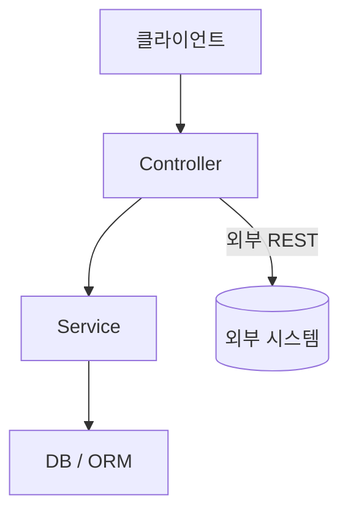

# project-struct — 프로젝트 구조 가이드

낯선 코드베이스를 체계적으로 분석해서 구조화된 온보딩 가이드를 만든다. 아키텍처/컨벤션뿐 아니라 **전체 API 카탈로그**와 **외부 시스템 연동 맵**까지 다룬다.

## 언제 사용하나

- Claude Code로 프로젝트를 처음 열었을 때
- 새 팀이나 저장소에 합류했을 때
- 사용자가 "이 코드베이스 이해하는 거 도와줘"라고 요청할 때
- 사용자가 프로젝트용 CLAUDE.md 생성을 요청할 때
- 사용자가 "온보딩해줘" 또는 "이 저장소 구조 좀 설명해줘"라고 할 때
- 사용자가 "API 목록/카탈로그 정리해줘"라고 요청할 때
- 사용자가 "이 프로젝트가 어떤 외부 시스템과 연동되는지 정리해줘"라고 요청할 때

## 동작 방식

### Phase 1: 정찰 (Reconnaissance)

모든 파일을 읽지 않고 프로젝트에 대한 원시 신호를 수집한다. 아래 항목들을 병렬로 확인한다:

```
1. 패키지 매니페스트 탐지
   → package.json, go.mod, Cargo.toml, pyproject.toml, pom.xml, build.gradle,
     Gemfile, composer.json, mix.exs, pubspec.yaml

2. 프레임워크 지문 인식(fingerprinting)
   → next.config.*, nuxt.config.*, angular.json, vite.config.*,
     django settings, flask app factory, fastapi main, rails config

3. 진입점(entry point) 식별
   → main.*, index.*, app.*, server.*, cmd/, src/main/

4. 디렉토리 구조 스냅샷
   → 디렉토리 트리 상위 2단계 (node_modules, vendor, .git, dist, build,
     __pycache__, .next 는 제외)

5. 설정/툴링 탐지
   → .eslintrc*, .prettierrc*, tsconfig.json, Makefile, Dockerfile,
     docker-compose*, .github/workflows/, .env.example, CI 설정

6. 테스트 구조 탐지
   → tests/, test/, __tests__/, *_test.go, *.spec.ts, *.test.js,
     pytest.ini, jest.config.*, vitest.config.*

7. API 정의 소스 탐지
   → openapi.yaml/json, swagger.json, routes/, controllers/, urls.py,
     *Controller.*, api/ 디렉토리, NestJS/FastAPI/Express 라우트 데코레이터·등록 코드

8. 외부 연동 시그널 탐지
   → .env(.example) 안의 외부 서비스로 보이는 키 접두어 (STRIPE_, AWS_, SLACK_,
     SENTRY_, TWILIO_ 등), HTTP client 사용처 (axios, fetch, requests, httpx,
     RestTemplate), 외부 SDK import (@aws-sdk, stripe, @slack/web-api 등),
     메시지 큐/이벤트 브로커 설정 (kafka, sqs, rabbitmq, redis pub/sub, webhook 핸들러)
```

### Phase 2: 아키텍처 매핑

**기술 스택** — 표로 정리한다:

```markdown
| 계층 | 기술 | 비고 |
|---|---|---|
| 언어/런타임 | ... | 버전 제약 |
| 프레임워크 | ... | ... |
| 데이터베이스/ORM | ... | ... |
| 빌드 도구/번들러 | ... | ... |
| CI/CD | ... | ... |
```

**아키텍처 패턴**
- 모놀리스 / 모노레포 / 마이크로서비스 / 서버리스 여부
- 프론트엔드-백엔드 분리 구조인지, 풀스택인지
- API 스타일: REST, GraphQL, gRPC, tRPC

**계층/컴포넌트 구조** — 이것도 표로 정리한다(디렉토리 맵과는 별개로, "이 요청이 어느
계층을 거쳐 가는지"에 집중):

```markdown
| 계층 | 위치 | 역할 |
|---|---|---|
| Controller/Handler | src/... | ... |
| Service | src/... | ... |
| Data Access | src/... | ... |
```

**주요 디렉토리**
최상위 디렉토리를 각 용도에 매핑한다:

<!-- 예시 — 실제 탐지된 디렉토리로 교체할 것 -->
```
src/components/  → UI 컴포넌트
src/api/         → API 라우트 핸들러
src/lib/         → 공용 유틸리티
src/db/          → 데이터베이스 모델 및 마이그레이션
tests/           → 테스트 스위트
scripts/         → 빌드/배포 스크립트
```

**데이터 흐름**
요청 하나가 진입점부터 응답까지 어떻게 흘러가는지 추적한다.

**아키텍처 다이어그램 (선택)** — 계층이 3개 이상이거나 외부 시스템/실시간 채널이
얽혀 있어 표만으로는 흐름이 한눈에 안 들어올 때만 Mermaid 다이어그램을 추가한다.
산출물이 Markdown 파일이므로 ` ```mermaid ` 코드펜스를 그대로 쓴다(GitHub·VS
Code·대부분의 Markdown 뷰어가 네이티브로 렌더링). 단순한 프로젝트에서 억지로
그리지 않는다 — 표로 충분하면 표만 쓴다.



권한/인가 규칙이 URL 패턴이나 미들웨어 기반으로 계층화돼 있다면, 그 흐름도 별도
다이어그램(flowchart LR)으로 표현할 수 있다. (별도로 HTML Artifact로
온보딩 결과를 시각화하게 되면 `../../references/visual-style.md`를 따른다 —
Mermaid 자체에는 적용되지 않는다.)

### Phase 3: 컨벤션 탐지

**네이밍 컨벤션** — 파일/컴포넌트/테스트 파일 네이밍 패턴
**코드 패턴** — 에러 처리 방식, 의존성 주입 여부, 상태 관리, 비동기 패턴
**Git 컨벤션** — 브랜치/커밋 스타일, PR 워크플로우. 히스토리가 얕으면 "Git 히스토리가 없거나 너무 얕아서 컨벤션을 탐지할 수 없음"이라고 명시

### Phase 4: API 카탈로그 작성

1. **소스 우선순위**: OpenAPI/Swagger 같은 공식 스펙 파일이 있으면 **그것을 1차 소스로 사용**한다. 코드에서 직접 재파싱해서 두 소스가 어긋나게 만들지 않는다.
2. 공식 스펙이 없으면 라우트/컨트롤러 파일을 Grep으로 스캔해서 추출한다.
3. 각 API 항목에 기록할 내용:
   - Method + URI
   - 핸들러 함수 · 파일 위치
   - 기능 한 줄 요약
   - 인증/권한 필요 여부
   - 파악 가능한 선에서 요청/응답 핵심 필드

출력 예시:

```markdown
| Method | URI | 기능 | 인증 | 위치 |
|--------|-----|------|------|------|
| POST | /api/users | 사용자 생성 | 불필요 | src/api/users.ts:12 |
| GET | /api/orders/:id | 주문 조회 | 필요 (로그인) | src/api/orders.ts:34 |
```

4. **데이터 전달 객체 카탈로그**: DTO/VO/Domain(Entity) 클래스가 코드베이스에
   있으면 API 카탈로그 문서 끝에 별도 섹션으로 추가한다.
   - 각 유형(DTO/VO/Entity)이 실제로 몇 개씩, 어느 패키지/디렉토리에 있는지 Glob으로
     센 뒤, 클래스명·용도(추정)·관련 도메인을 표로 정리한다. 필드까지 전수 검증할
     필요는 없다 — 모호한 클래스만 선별적으로 Read해서 확인한다.
   - 이 개념들이 처음 보는 사람에게 헷갈릴 수 있으므로, DTO/VO/Domain의 차이를
     짧게 설명하는 섹션도 함께 넣는다: DTO(계층 간 전달용, 가변, 동등성 비교 없음)
     / VO(값 자체를 표현, 불변, 값 기준 동등성) / Domain·Entity(업무 개념+상태·행위,
     식별자 기준 동등성, 영속성 매핑). 이 프로젝트가 실제로 어떤 유형만 쓰고 있는지
     ("VO 계층 없음" 등)도 명시한다 — 일반론만 늘어놓지 않는다.
   - 해당 유형의 클래스가 하나도 없으면 이 섹션 자체를 생략한다(억지로 채우지 않음).

### Phase 5: 외부 시스템 연동 맵

목표: **"어떤 기능/메소드가 어떤 외부 시스템을 쓰는지"** 역방향으로 추적한다.

1. 외부 SDK/HTTP client import 지점을 Grep으로 찾는다.
2. 그 지점을 호출하는 상위 함수/서비스/기능 이름까지 역추적한다.
3. 동기 호출(REST/gRPC 외부 API)과 비동기 연동(메시지 큐, webhook, 이벤트)을 구분해서 기록한다.
4. 인증 방식(API key, OAuth, mTLS 등)을 기록한다.
5. 재시도/fallback 정책이 코드에 실제로 보이면 기록하고, 안 보이면 **"확인되지 않음"**이라고 명시한다 — 추측하지 않는다.

출력 예시:

```markdown
| 기능/메소드 | 외부 시스템 | 연동 방식 | 인증 방식 | 위치 |
|------------|------------|----------|----------|------|
| 결제 승인 (PaymentService.charge) | Stripe | 동기 REST | API key | src/services/payment.ts:45 |
| 주문 알림 (OrderNotifier.notify) | Slack | Webhook (비동기) | Webhook URL | src/services/notify.ts:20 |
```

### Phase 6: 온보딩 산출물 생성

산출물은 프로젝트 루트의 `CLAUDE.md` 하나와, `docs/` 아래 파일 3개로 나눈다.
각 파일의 최상위 제목과 각 `##` 섹션 제목에는 내용을 압축해 보여주는 이모지를
하나씩 붙인다(예: 📌 구조, 🧩 스택, 🏗️ 아키텍처, 🔐 권한, 📝 컨벤션, ⚠️ 문제점,
📡 API, 🔗 외부연동). 과하게 넣지 않는다 — 제목당 1개면 충분하다.

#### 산출물 1: `docs/STRUCTURE.md` (구조 가이드)

```markdown
# 📌 구조 가이드 — [프로젝트 이름]

## 📋 개요
[2~3문장: 이 프로젝트가 무엇을 하고, 누구를 위한 것인지]

## 🧩 기술 스택
| 계층 | 기술 | 비고 |
|---|---|---|
| 언어/런타임 | ... | ... |
| 프레임워크 | ... | ... |
| 데이터베이스 | ... | ... |

## 🏗️ 아키텍처
[Phase 2 결과: 계층 표 + 필요 시 Mermaid 다이어그램]

## 🗂️ 디렉토리 맵
[최상위 디렉토리 → 용도]

## 📝 컨벤션
| 구분 | 규칙 |
|---|---|
| 네이밍 | [파일/클래스/컴포넌트 네이밍 패턴] |
| 코드 패턴 | [에러 처리 방식, 의존성 주입 여부, 상태 관리, 비동기 패턴 등] |
| 테스트 | [테스트 파일 패턴, 커버리지 현황] |
| Git 컨벤션 | [브랜치/커밋 스타일, PR 워크플로우] |

(위 4개는 기본 항목이며, 이 프로젝트에서만 발견되는 특이한 컨벤션(예: URL 프리픽스로 권한을 구분하는 규칙 등)이 있으면 행을 추가한다.)

## ⚠️ 알려진 문제점 Top 10
[코드베이스를 스캔하며 실제로 확인한 것만 최대 10개. 추측성 항목 제외 —
"~일 가능성" 같은 표현을 쓸 땐 근거(파일:줄)를 함께 남긴다. 심각도 순으로
정렬한다(보안/데이터 손실 > 안정성 > 유지보수성). 프로젝트가 이미 잘
관리되고 있어 진짜 문제가 5개 미만이면 억지로 10개를 채우지 않는다.]

## 📚 상세 문서
- API 카탈로그: [docs/API.md](API.md)
- 외부 시스템 연동 맵: [docs/EXTERNAL-SYSTEMS.md](EXTERNAL-SYSTEMS.md)

## 🧭 어디를 봐야 하나
| 하고 싶은 일 | 살펴볼 곳 |
|--------------|-----------|
| API 엔드포인트 추가 | ... |
| 외부 시스템 연동 추가 | ... |
```

#### 산출물 2: `docs/API.md` (API 카탈로그)

Phase 4 결과(엔드포인트 표, 컨트롤러/모듈 단위로 섹션 분리)를 담고, 코드베이스에
DTO/VO/Domain 클래스가 있으면 그 카탈로그와 "DTO/VO/Domain 개념 차이" 설명 섹션을
문서 끝에 추가한다. 엔드포인트가 적어 온보딩 가이드 한 문서에 다 들어가면 별도
파일로 안 쪼개도 된다 — 많을 때만(대략 30개 이상) 분리한다.

#### 산출물 3: `docs/EXTERNAL-SYSTEMS.md` (외부 시스템 연동 맵)

Phase 5 결과를 담는다. 연동 항목이 적으면(3~4개 이하) `STRUCTURE.md`에 표만
넣고 별도 파일을 생략해도 된다. 자격증명이 코드나 설정 파일에 평문으로 노출된
게 확인되면(git에 커밋된 `.env`/`application.properties` 등) 이 문서에
"⚠️ 보안 주의사항" 섹션으로 반드시 기록하고, 사용자에게 채팅으로도 별도 요약해
알린다 — 발견 즉시 알리는 게 우선이지 코드 수정 여부와는 별개다.

#### 산출물 4: 시작용 `CLAUDE.md`

기존 `CLAUDE.md`가 있으면 먼저 읽고 보강한다 (대체 금지). 100줄 이내로 간결하게
유지하고, API 카탈로그/외부 연동 맵/문제점 목록처럼 세부 정보는 CLAUDE.md에
통째로 넣지 않고 `docs/STRUCTURE.md`·`docs/API.md`·`docs/EXTERNAL-SYSTEMS.md`를
가리키는 링크만 남긴다. 보안 이슈가 발견됐다면 CLAUDE.md에도 한 줄 경고 + 링크를
남겨서, 이후 세션에서도 바로 눈에 띄게 한다.

## 모범 사례 (Best Practices)

1. **모든 파일을 읽지 말 것** — 정찰 단계는 Read가 아니라 Glob/Grep으로 수행한다. API·외부연동 탐지도 동일 원칙으로, 모호한 신호가 있을 때만 선별적으로 Read한다.
2. **추측하지 말고 검증할 것** — 설정 파일로 프레임워크가 탐지됐지만 실제 코드가 다른 걸 쓰고 있다면, 코드를 신뢰한다. 특히 외부 연동은 실제 import/호출 지점이라는 코드 근거 없이는 기록하지 않는다.
3. **기존 스펙을 소스로 삼을 것** — OpenAPI 등 공식 API 스펙이 있으면 그것을 1차 소스로 쓰고, 코드에서 재작성해 두 소스가 어긋나지 않게 한다.
4. **기존 CLAUDE.md를 존중할 것** — 이미 있다면 대체하지 말고 보강한다. 무엇이 새로 추가됐고 무엇이 기존 것인지 명시한다.
5. **간결하게 유지할 것** — CLAUDE.md는 2분 안에 훑어볼 수 있어야 한다(100줄 이내). API 카탈로그·외부 연동 맵처럼 분량이 많은 세부 정보는 별도 문서로 분리해 필요한 사람만 펼쳐보게 한다.
6. **모르는 것은 모른다고 표시할 것** — 컨벤션이나 재시도 정책·인증 방식처럼 확신 있게 탐지할 수 없는 정보는 추측하지 말고 그렇게 말한다. "재시도 정책 확인되지 않음"이 틀린 답보다 낫다.
7. **이모지는 제목당 1개, 절제해서** — 각 파일 최상위 제목과 `##` 섹션 제목 앞에만 붙인다. 표 안의 셀이나 본문 문장 중간에는 넣지 않는다.
8. **다이어그램은 표로 부족할 때만** — 계층이 단순하거나(2단 이하) 외부 연동이 없는 프로젝트는 다이어그램 없이 표만으로 충분하다. 다이어그램을 넣을 땐 실제 코드에서 확인한 연결 관계만 그린다(추측성 화살표 금지).
9. **문제점 발견 시 즉시 알릴 것** — 자격증명 평문 노출, 하드코딩된 시크릿 키처럼 보안에 직결되는 문제를 Phase 1~5 정찰 중 발견하면, 산출물 문서에 기록하는 것과 별개로 대화창에서도 바로 요약해 사용자에게 알린다. 문서에만 적어두고 넘어가지 않는다.

## 피해야 할 안티패턴

- 100줄을 넘는 CLAUDE.md 생성 — 초점을 좁게 유지할 것
- 모든 의존성을 나열하는 것 — 코드 작성 방식에 실제로 영향을 주는 것만 강조할 것
- 자명한 디렉토리 이름까지 설명하는 것 — `src/`는 설명이 필요 없다
- README를 그대로 베끼는 것 — 온보딩 가이드는 README에 없는 구조적 통찰을 더해야 한다
- OpenAPI 스펙이 있는데 무시하고 코드에서 API 목록을 다시 뽑아 두 소스가 어긋나게 만드는 것
- 모든 내부 함수 호출을 "연동"으로 나열하는 것 — 실제로 프로젝트 경계를 넘어가는(외부 시스템) 호출만 기록할 것
- 문제점 Top 10을 채우려고 사소하거나 근거 없는 항목을 억지로 끼워넣는 것 — 진짜 문제만, 근거(파일:줄)와 함께
- 모든 프로젝트에 획일적으로 Mermaid 다이어그램을 넣는 것 — 표로 충분한 단순 구조에는 넣지 않는다

## 예시

### 예시 1: 새 저장소에 처음 진입
**사용자**: "이 코드베이스 온보딩해줘"
**동작**: 6단계 전체 워크플로우 실행 → 온보딩 가이드 + 시작용 CLAUDE.md 생성
**결과**: 온보딩 가이드는 대화창에 바로 출력, `CLAUDE.md`는 프로젝트 루트에 파일로 작성

### 예시 2: 기존 프로젝트용 CLAUDE.md 생성
**사용자**: "이 프로젝트용 CLAUDE.md 만들어줘"
**동작**: Phase 1~3만 실행, 온보딩 가이드는 생략하고 CLAUDE.md만 생성
**결과**: 탐지된 컨벤션이 반영된 프로젝트 전용 `CLAUDE.md`

### 예시 3: 기존 CLAUDE.md 보강
**사용자**: "CLAUDE.md를 현재 프로젝트 컨벤션에 맞춰 업데이트해줘"
**동작**: 기존 CLAUDE.md를 읽고 Phase 1~3 실행 후 새로운 내용과 병합
**결과**: 추가된 부분이 명확히 표시된 갱신된 `CLAUDE.md`

### 예시 4: API 카탈로그만 요청
**사용자**: "이 프로젝트 API 목록 정리해줘"
**동작**: Phase 1(API 관련 신호만) + Phase 4만 실행
**결과**: API 카탈로그 표를 대화창에 출력, 항목이 많으면(대략 30개 이상) `docs/API.md`로 저장 제안

### 예시 5: 외부 연동 맵만 요청
**사용자**: "이 프로젝트가 어떤 외부 시스템들이랑 연동되는지 정리해줘"
**동작**: Phase 1(연동 신호만) + Phase 5만 실행
**결과**: 기능/메소드 ↔ 외부 시스템 매핑 표 출력, 항목이 많으면 `docs/EXTERNAL-SYSTEMS.md`로 저장 제안

### 예시 6: 표/다이어그램/DTO 카탈로그 보강 요청
**사용자**: "스택이랑 아키텍처도 표로 보여주고, 구조 관련 그림 있으면 넣어주고, DTO/VO/Domain 클래스랑 그 개념 차이도 설명해줘, 문제점도 Top 10 정리해줘"
**동작**: 이미 생성된 산출물이 있으면 그 위에 Phase 2(표+다이어그램)·Phase 4(DTO/VO/Domain 카탈로그)를 보강하고, `STRUCTURE.md`에 "알려진 문제점 Top 10" 섹션을 추가한다
**결과**: `docs/STRUCTURE.md`·`docs/API.md`가 갱신되고, `CLAUDE.md`의 링크도 최신 파일명을 가리키도록 맞춘다
